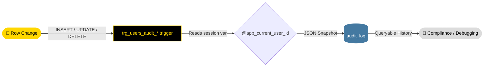
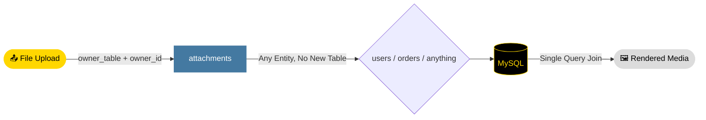
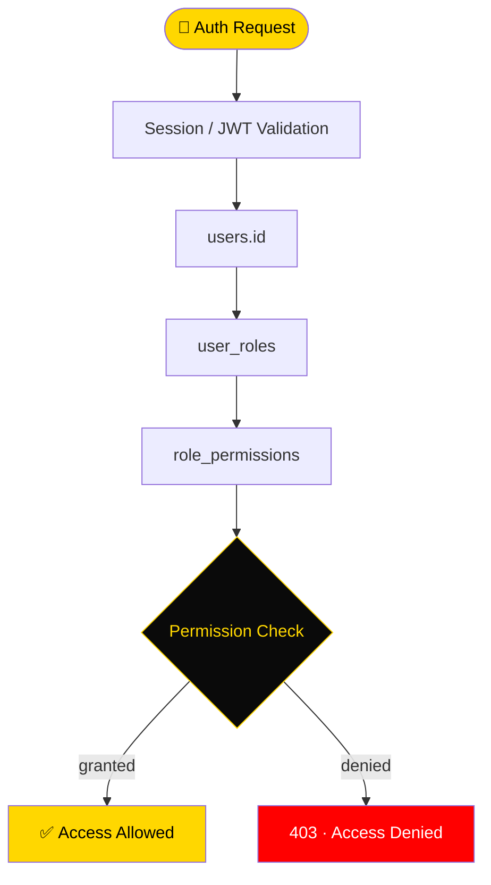

<div align="center">


[](https://git.io/typing-svg)

<br/>

<p align="center">
  <a href="https://committers.top/colombia">
    
  </a>
  <a href="https://committers.top">
    
  </a>
  
  
</p>

<p align="center">
  
  
  
  
  
  
  
</p>

<p align="center">
  <a href="https://github.com/NietoDeveloper/MySQL_DataBase">
    
  </a>
</p>

<br/>

> **Functional MySQL Starter Database:** *The identity, access-control, and audit foundation meant to be dropped into any new project — MERN, Next.js, or otherwise.*

> 🐬 **MySQL Functional Starter Schema.** A small, dependency-free, enterprise-grade foundation built with plain SQL migrations, triggers, and stored procedures, delivering authentication, role-based access control, automatic audit trails, polymorphic file attachments, notifications, and a settings store out of the box.
> State-of-the-art schema design for real-time auditability and reusable data orchestration across **any** Digital Twin, e-commerce, or SaaS ecosystem. A production-grade, ORM-agnostic foundation connecting new projects to a scalable, secure, Dockerized database — in minutes, not days.
>
> *Modular · Robust · Obsessively Production-Ready · Built in Bogotá 🇨🇴*

</div>

---

## 🆕 Latest Schema Updates

<div align="center">


</div>

The initial release cycle of the Functional MySQL Starter Database introduced the following architectural and infrastructure decisions:

| Update | Description | Impact |
|:-------|:-------------|:-------|
| 🔐 **Core Identity & RBAC** | `users`, `roles`, `permissions`, `role_permissions`, `user_roles`, and `sessions` tables — a complete, reusable auth foundation | Drop-in login/access-control layer for any new project, no rewrite needed |
| 🧾 **Functional Audit Trail** | Per-table `AFTER INSERT/UPDATE/DELETE` triggers writing JSON before/after snapshots into `audit_log`, running with definer privileges | Full accountability on any table you wire up, without granting write access to the log itself |
| 📎 **Polymorphic Attachments** | `owner_table` + `owner_id` pattern lets any record in any table hold files without a dedicated join table | Faster iteration — no schema migration needed per new entity |
| ♻️ **Soft Deletes & Native Timestamps** | `deleted_at` on sensitive tables, `updated_at` via MySQL's native `ON UPDATE CURRENT_TIMESTAMP` — no trigger overhead | History and audit integrity preserved by default |
| 🔌 **Drop-In Connection Layer** | `client/` — a typed `mysql-database-client` package wrapping pooling, the row-scoped view pattern, and auth queries; `examples/express-api/` — a runnable JWT auth API built on it | Any frontend reaches this database safely in minutes, through a proper backend boundary — see `docs/CONNECTING.md` |
| 📈 **Performance & Scalability Pass** | Composite indexes matched to real query patterns, tuned InnoDB buffer pool + slow-query log, bounded housekeeping for `sessions`/`audit_log`, a read-replica playbook | Flat latency as tables grow, with a documented path past a single instance — see `docs/PERFORMANCE.md` |
| 🔐 **Pre-Auth Views** | `v_auth_lookup`, `v_auth_registration`, `v_session_lookup` — narrow views for the login/registration/refresh gap where `@app_current_user_id` isn't known yet | Closes the one structural hole in the row-scoped-view model without granting broad table access |

---

## 🏗️ Schema Architecture

```
╔══════════════════════════════════════════════════════════════════════╗
║                FUNCTIONAL MYSQL STARTER SCHEMA                       ║
╠══════════════════════════════════════════════════════════════════════╣
║                                                                        ║
║   ┌─────────────────────┐       ┌──────────────────────────────┐     ║
║   │   IDENTITY CLUSTER   │      │        ACCESS CLUSTER          │     ║
║   │                     │       │                                │     ║
║   │  users              │◄─────►│  roles · permissions           │     ║
║   │  sessions           │       │  role_permissions · user_roles │     ║
║   └──────────┬──────────┘       └─────────────┬──────────────────┘     ║
║              │                                │                        ║
║              └──────────────┬─────────────────┘                        ║
║                             ▼                                          ║
║              ┌──────────────────────────────┐                          ║
║              │   Trigger & Procedure Layer   │                         ║
║              │   ON UPDATE CURRENT_TIMESTAMP │                         ║
║              │   trg_users_audit_*            │                         ║
║              └──────────────┬───────────────┘                          ║
║                             │                                          ║
║           ┌─────────────────┼─────────────────┐                        ║
║           ▼                 ▼                 ▼                        ║
║   ┌───────────────────┐ ┌───────────────────────┐ ┌───────────────┐    ║
║   │  audit_log         │ │  attachments            │ │  notifications │    ║
║   │  JSON snapshots     │ │  Polymorphic file table │ │  user_settings │    ║
║   │  Full history       │ │  owner_table+owner_id   │ │  app_settings  │    ║
║   └───────────────────┘ └───────────────────────┘ └───────────────┘    ║
╚══════════════════════════════════════════════════════════════════════╝
```

---

## 📂 Repository Structure

```text
MySQL_DataBase/                     ← Repo Root
│
├── 🗄️ migrations/                  ← Run in numeric order
│   ├── 001_schema_core.sql         ← users, roles, permissions
│   ├── 002_schema_sessions.sql     ← hashed refresh-token sessions
│   ├── 003_schema_audit.sql        ← audit_log
│   ├── 004_schema_files.sql        ← attachments
│   ├── 005_schema_notifications.sql
│   ├── 006_schema_settings.sql     ← app_settings, user_settings
│   ├── 007_triggers_procedures.sql ← audit triggers + lockout procedures
│   ├── 008_seed.sql                ← baseline roles & permissions
│   ├── 009_security_hardening.sql  ← roles, grants, row-scoped views
│   ├── 010_performance_scalability.sql ← composite indexes + housekeeping
│   ├── 011_auth_surface.sql        ← pre-auth login/registration views
│   └── 012_session_lookup.sql      ← pre-auth refresh-token lookup view
│
├── 🔌 client/                      ← `mysql-database-client` — the connection layer
│   └── src/                         (pool.ts, context.ts, queries.ts, db.ts)
│
├── 🧪 examples/express-api/        ← Runnable reference: JWT auth REST API
│   └── src/server.ts                (register, login, refresh, logout, /me)
│
├── 🛠️ scripts/
│   ├── init.sh                     ← applies all migrations
│   ├── create_app_role.sh          ← provisions the least-privilege app account
│   ├── reset.sh                    ← drops & re-applies everything (destructive)
│   └── generate_dev_certs.sh       ← throwaway TLS certs for local DB_SSL testing
│
├── 📖 docs/
│   ├── ERD.md                      ← entity relationship diagram (Mermaid)
│   ├── CONNECTING.md               ← how a frontend reaches this database, safely
│   └── PERFORMANCE.md              ← pooling, indexing, replicas, scaling past one instance
│
├── 🐳 docker-compose.yml           ← mysql + optional api + optional adminer (profiles)
├── ⚙️ .env.example
├── 📜 SECURITY.md                  ← hardening notes & MySQL-vs-Postgres tradeoffs
└── 📜 LICENSE
```

---

## 🛠️ Unified Technology Stack

<div align="center">

| Layer | Technologies | Engineering Focus |
|:------|:-------------|:------------------|
| 🐬 **Database Engine** | MySQL 8.0 (InnoDB, utf8mb4) | ACID compliance · JSON columns · row triggers |
| 🧬 **Migrations** | Plain SQL, numeric-ordered | ORM-agnostic — Prisma, TypeORM, Sequelize, Knex, raw `mysql2` |
| ⚙️ **Logic Layer** | Triggers & stored procedures | Reusable audit + lockout automation |
| 🔑 **Auth** | UUID identities · JWT-ready sessions | Multi-device refresh-token sessions |
| 🛡️ **Access Control** | RBAC (roles · permissions · mappings) | Fine-grained, per-endpoint authorization |
| 🧾 **Auditability** | JSON before/after snapshots | Full accountability, opt-in per table |
| 📎 **Storage Pattern** | Polymorphic attachments | One table, any entity, any file |
| 🔌 **Connection Layer** | TypeScript · `mysql2/promise` · pooled | Typed queries, pool sizing guidance, the row-scoped-view footgun fixed in code, not docs |
| 🧪 **Reference API** | Node.js 22 · Express · JWT · bcrypt · Helmet | Complete auth flow any frontend can call over HTTPS/JSON |
| 🐳 **DevOps** | Docker Compose (profiles: core / `with-api` / `dev-tools`) · official MySQL 8.0 image | Container-first · Zero local dependencies |

</div>

---

## ✨ Core Design Flows

### 🔄 Functional Audit Trail Pipeline



### 📎 Polymorphic Attachment Pipeline



### 🔐 RBAC Authorization Flow



---

## 🗄️ What's Included

<div align="center">

| Table | Purpose |
|:------|:--------|
| `users` | Core identity table — email, username, password hash, soft delete |
| `roles` / `permissions` / `role_permissions` / `user_roles` | RBAC access control |
| `sessions` | Hashed refresh tokens for authenticated sessions |
| `audit_log` | Automatic before/after snapshot of row changes (JSON) |
| `attachments` | Polymorphic file table — attach a file to any row in any table |
| `notifications` | Per-user notification inbox |
| `app_settings` / `user_settings` | Global and per-user key/value configuration |

</div>

---

## 🐳 Docker Infrastructure Guide

> **Zero local dependencies.** Docker handles MySQL, migrations, networking, and port binding — identical behavior from your laptop to production.

### Prerequisites

Install **[Docker Desktop](https://www.docker.com/products/docker-desktop/)** and ensure the engine is running.

### ⚡ Quick Start — 2 Steps to a Ready Database

**Step 1 — Clone the repository**

```bash
git clone https://github.com/NietoDeveloper/MySQL_DataBase.git
cd MySQL_DataBase
cp .env.example .env
```

**Step 2 — Launch the master orchestrator**

```bash
docker compose up -d
```

```
🤖 What Docker does automatically:
   ├── Pulls mysql:8.0 (official image)
   ├── Creates the root account & functional_db database
   ├── Applies every file in migrations/ on first boot, in order
   ├── Wires the trigger + procedure layer (audit + lockout)
   └── Seeds baseline roles & permissions

   🐬  MySQL  →  localhost:3306
```

To apply migrations against an **existing** database instead of a fresh
container:

```bash
export MYSQL_HOST=localhost MYSQL_PORT=3306 MYSQL_USER=root MYSQL_PASSWORD=change_me MYSQL_DATABASE=functional_db
./scripts/init.sh
```

Then provision the application account (never use `root` in your app):

```bash
export APP_DB_PASSWORD=$(openssl rand -base64 32)
./scripts/create_app_role.sh
```

### 🔌 Optional services — one flag away

`docker-compose.yml` uses [Compose
profiles](https://docs.docker.com/compose/how-tos/profiles/) so the
default `docker compose up -d` stays minimal (just MySQL), and you opt
into the rest per environment:

```bash
# MySQL + the reference JWT auth API (see docs/CONNECTING.md)
docker compose --profile with-api up -d --build

# + Adminer, a web GUI for browsing the schema (local dev only —
#   never enable this against a production database)
docker compose --profile dev-tools up -d
```

```
   🐬  MySQL    →  localhost:3306   (always)
   🧪  API      →  localhost:4000   (--profile with-api)
   🗄️  Adminer   →  localhost:8081   (--profile dev-tools)
```

### 🛑 Operations & Maintenance

```bash
# Stop the database & release the port
docker compose down

# Full reset — DANGER: drops all data, re-applies every migration
./scripts/reset.sh

# View live logs
docker compose logs -f mysql

# Check running containers
docker ps

# Clean up unused images & volumes
docker system prune -f
```

---

## 🔌 Connecting from a Frontend

> **A browser never talks to MySQL directly** — no client-side library
> can hold a database password safely, and MySQL doesn't speak HTTP.
> The correct boundary is a small backend in between, and this repo
> ships one ready to use.

```
┌──────────┐   HTTPS / JSON (fetch, axios)   ┌───────────────┐   TCP + TLS   ┌─────────┐
│ Frontend │ ───────────────────────────────►│ examples/      │──────────────►│  MySQL  │
│ (React,  │◄───────────────────────────────│ express-api/   │◄──────────────│         │
│ Vue, …)  │      JWT-protected responses     │  (uses client/) │               └─────────┘
└──────────┘                                  └───────────────┘
```

```js
// From any frontend framework — plain fetch, no SDK required
const { accessToken, refreshToken } = await fetch("http://localhost:4000/auth/login", {
  method: "POST",
  headers: { "Content-Type": "application/json" },
  body: JSON.stringify({ email, password }),
}).then((r) => r.json());

const me = await fetch("http://localhost:4000/me", {
  headers: { Authorization: `Bearer ${accessToken}` },
}).then((r) => r.json());
```

Building your own backend instead of the example API? Depend on
`client/` directly from any Node.js service:

```ts
import { getPool, withUserContext, findUserByEmail } from "mysql-database-client";

const pool = getPool();                                    // reads DB_* from env, pools connections
const user = await findUserByEmail(pool, "someone@example.com");
```

Full walkthrough — token storage on the frontend, building your own
API, non-Node backends, GraphQL/tRPC/SSR, production TLS — in
**[`docs/CONNECTING.md`](./docs/CONNECTING.md)**.

---

## 📈 Performance & Scalability

Already tuned out of the box: composite indexes matched to the
schema's real query patterns, a tuned InnoDB buffer pool + slow-query
log, and bounded daily cleanup of `sessions` (audit_log retention stays
a deliberate manual call — see `010_performance_scalability.sql`).

| Concern | What's already done | Where to go next |
|:--------|:---------------------|:------------------|
| Connection handling | Pooled, not per-request (`client/src/pool.ts`) | Size to `CPU cores × 2`, then measure |
| Query latency | Composite indexes for auth, session cleanup, inbox pagination, attachment listing | `EXPLAIN` the actual slow query before adding infrastructure |
| Unbounded growth | `sessions` auto-pruned daily via a MySQL `EVENT`; `audit_log` archived on your own schedule via `archive_audit_log_older_than()` | Add retention for `notifications`/`attachments` if your usage pattern needs it |
| Read scaling | — | Add a MySQL replica + a second pool pointed at it (`client/` supports this today, no code changes) |
| Beyond one primary | — | ProxySQL/MySQL Router for read/write splitting; sharding only as a last resort |

Full detail, including replica setup and pool-sizing math, in
**[`docs/PERFORMANCE.md`](./docs/PERFORMANCE.md)**.

---

## 🧩 Design Choices

- **UUID (`CHAR(36)`) primary keys** everywhere except small lookup
  tables (`roles`, `permissions`), which use `SMALLINT AUTO_INCREMENT`
  since they rarely grow.
- **Soft deletes** (`deleted_at`) on `users` and `attachments` instead of
  hard deletes, so history and audit trails stay intact.
- **`updated_at` handled natively** via `ON UPDATE CURRENT_TIMESTAMP` —
  no trigger required, unlike the Postgres edition of this project.
- **Audit triggers are opt-in, per table, per statement type** —
  `007_triggers_procedures.sql` wires three (`INSERT`/`UPDATE`/`DELETE`)
  onto `users` as an example; copy the pattern for any other table.
- **Polymorphic attachments** (`owner_table` + `owner_id`) avoid needing a
  new file table for every entity in the project.
- **`utf8mb4_0900_ai_ci` collation** on email/username for accent- and
  case-insensitive uniqueness without manual `LOWER()` handling — MySQL's
  equivalent of Postgres `CITEXT`.
- **Row-scoped access via views, not native RLS** — MySQL has no
  Row-Level Security, so the closest equivalent uses filtered updatable
  views + a session variable. See `docs/SECURITY.md` for the honest
  tradeoffs of this approach before relying on it.

---

## 🚀 Extending It

This is meant to be a foundation, not the final schema. Typical next step
for a real project: add domain tables (e.g. `orders`, `products`) that
reference `users.id`, and optionally add an audit trigger set for them too:

```sql
DELIMITER $$
CREATE TRIGGER trg_orders_audit_insert
AFTER INSERT ON orders
FOR EACH ROW
BEGIN
    INSERT INTO audit_log (table_name, record_id, action, new_data, changed_by)
    VALUES ('orders', NEW.id, 'INSERT', JSON_OBJECT('id', NEW.id, 'status', NEW.status),
            NULLIF(@app_current_user_id, ''));
END$$
DELIMITER ;
```

```
┌─────────────────────────────────────────────────────────┐
│                  TYPICAL ADOPTION PATH                   │
│                                                           │
│  git clone MySQL_DataBase                                 │
│       │                                                   │
│       ├──► docker compose up -d  → Ready in ~15s          │
│       │                                                   │
│       ├──► Add domain tables (orders, products, etc.)     │
│       │    referencing users.id                           │
│       │                                                   │
│       └──► Copy the trigger pattern where audit matters    │
└─────────────────────────────────────────────────────────┘
```

---

## 🔗 Links & Resources

<div align="center">

| Resource | Link |
|:---------|:-----|
| 📂 **GitHub Repository** | [github.com/NietoDeveloper/MySQL_DataBase](https://github.com/NietoDeveloper/MySQL_DataBase) |
| 🔌 **Connecting a Frontend** | [`docs/CONNECTING.md`](./docs/CONNECTING.md) |
| 📈 **Performance & Scalability** | [`docs/PERFORMANCE.md`](./docs/PERFORMANCE.md) |
| 🛡️ **Security Hardening Notes** | [`SECURITY.md`](./SECURITY.md) |
| 🗺️ **Entity Relationship Diagram** | [`docs/ERD.md`](./docs/ERD.md) |
| 👤 **Developer Profile** | [github.com/NietoDeveloper](https://github.com/NietoDeveloper) |
| 🏆 **#1 Colombia Ranking** | [committers.top/colombia](https://committers.top/colombia) |
| 🌎 **Top LATAM Ranking** | [committers.top](https://committers.top) |
| 🐳 **Docker Desktop** | [docker.com/products/docker-desktop](https://www.docker.com/products/docker-desktop/) |

</div>

---

<div align="center">

[](https://github.com/NietoDeveloper)
[](https://committers.top/colombia)
[](https://committers.top)

<br/>

```
╔══════════════════════════════════════════════════════════════════╗
║                                                                  ║
║   "Every schema is a foundation. Build it once,                  ║
║    reuse it everywhere, audit it always."                        ║
║                                                                  ║
║                               — NietoDeveloper Standard          ║
╚══════════════════════════════════════════════════════════════════╝
```

*MySQL Functional Starter Database — Built by **NietoDeveloper · Manuel Nieto***

*Developed with technical rigor in* 📍 **Bogotá, Colombia** 🇨🇴

<br/>


</div>
