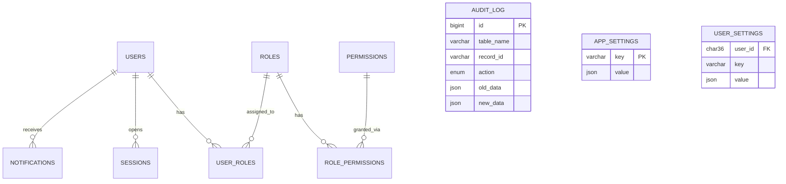

# Entity Relationship Diagram

`ATTACHMENTS` uses a polymorphic pattern (`owner_table` + `owner_id`) so it can
attach a file to a row in **any** table without a dedicated foreign key per
entity — this is what makes the schema reusable across projects.

`SESSIONS`, `NOTIFICATIONS`, `USER_SETTINGS`, and `USERS` itself are exposed
to the application role only through row-scoped views
(`v_my_sessions`, `v_my_notifications`, `v_my_settings`, `v_my_profile`) —
see `docs/SECURITY.md` for why, since MySQL has no native Row-Level Security.
